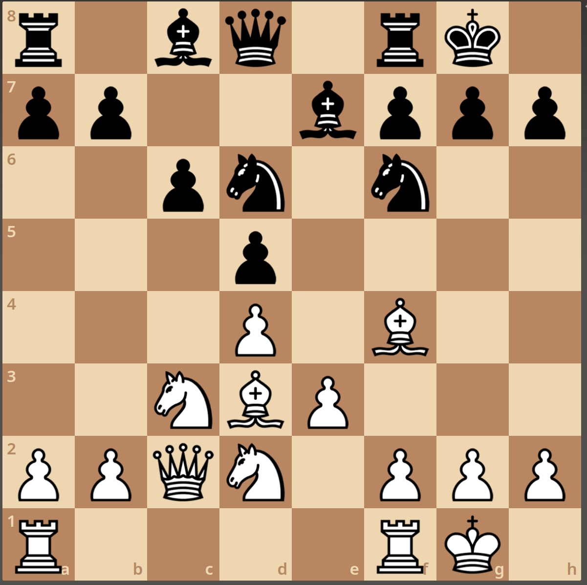

# Example: one position, positional analysis (`chess-position` skill)



`r1bq1rk1/pp2bppp/2pn1n2/3p4/3P1B2/2NBP3/PPQN1PPP/R4RK1 w - - 0 1`

Input: this screenshot, no game, and the request "focus on the positional
understanding of this position". Side to move was not given, and White was
assumed. The skill now forbids that: with an image, it must ask whose turn
it is. (Here it happened not to matter much: with Black to move the plans
are the same and the eval is +0.2.)

Video: [position-f5.mp4](position-f5.mp4) (4:17, narrated, subtitles).

## The analysis

**Structure.** White has d4 and e3, Black has c6 and d5, and the c and e
pawns are gone. This is the Carlsbad structure (Queen's Gambit Exchange),
recognized from the missing pawns alone.

**Bishops.** Black's fixed pawns stand on light squares, so the c8 bishop
is Black's bad bishop. White's d3 bishop is the good one. Black's whole
strategic goal is to trade the light-squared bishops.

**The Qc2 + Bd3 battery sets the constraints.** It aims at f5 and h7.

- ...Bf5? and ...Nf5? lose a piece: f5 is attacked twice, defended once (+5.1).
- ...Nh5? loses h7 with check: the f6 knight is h7's only guard (+2.2).

So Black's key move is ...g6. It covers f5 and cuts the h7 diagonal. After
it, ...Bf5 trades the bad bishop and the eval goes to 0.00.

**The d6 knight cuts both ways.** It covers b5, c4, e4 and f5, which slows
the minority attack. But it blocks the e7 bishop and freezes the c-pawn:
...c5? dxc5 hits the knight (+2.9). So c6 stays fixed as a target.

**White's plan.**

- h3 first. It takes g4 from Black's pieces and frees h2 for the f4
  bishop. Without it, ...g6 and ...Nh5 force White to give up that bishop.
  With it, Bh2 keeps it.
- A rook to c1, on the half-open file, aimed at c6.
- Knight to a4 and c5. Only ...b6 can chase it, and ...b6 loosens c6.
- Minority attack: b4, a4, then b5 against c6.

**What White should not do.** Bxh7+?? (no knight can reach g5, -4.5), g4?
(loses the pawn), e4 now (isolated d4 pawn, costs ~0.65), Bxd6 (gives Black
the bishop pair, costs ~0.7).

**Verdict.** The position turns on two squares: f5 for Black, c5 (and the
b5 break) for White. White is about +0.4, and five White moves score
within 0.1 of each other at depth 28 (Rfc1, h3, Rac1, Nf3, Rfe1), so the
plan matters more than the exact move.

## One correction along the way

The first narration draft said "no black pawn can attack c5". That is
false: ...b6 does. It was caught on a re-read and fixed. This is why the
skill's references ask you to check every "cannot" and "only" claim
against the board.

## Files

| file | what |
|---|---|
| `position.png` | the input screenshot |
| `position.pgn` | the position as a PGN with a `[FEN]` tag and no moves |
| `storyboard.json` | video storyboard, every shot at `"ply": 0` |
| `position-f5.mp4`, `.srt` | the narrated video and its subtitles |

To regenerate the video, download the piper voice into
`examples/position-carlsbad/voices/` (see `skills/chess-video/SKILL.md`)
and run:

```sh
.venv-chess/bin/python skills/chess-video/scripts/make_video.py \
    examples/position-carlsbad/storyboard.json "$PWD/examples/position-carlsbad/position-f5.mp4"
```
